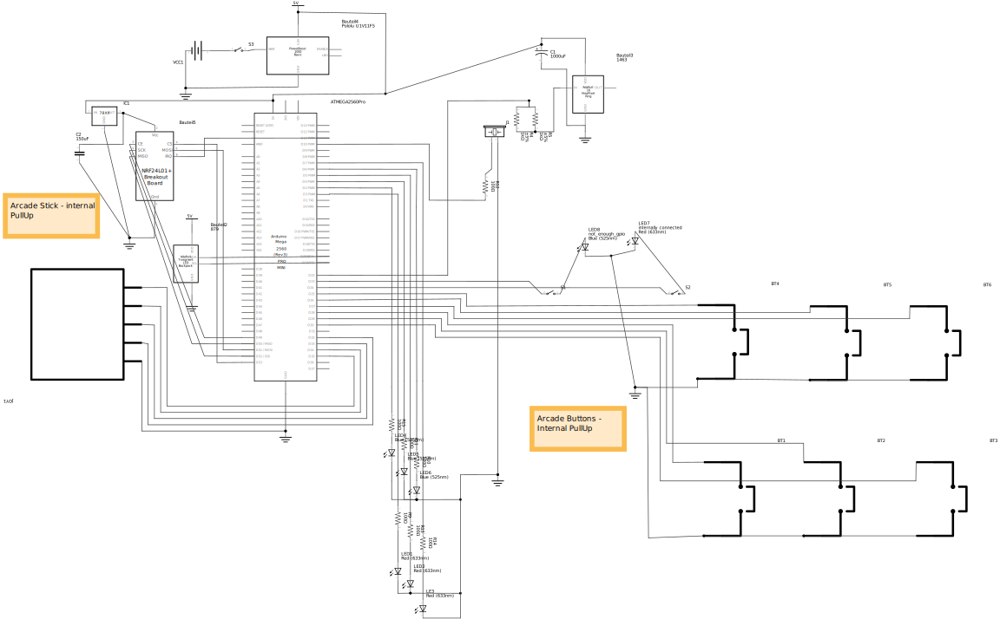

# Repository for creating a ButtonBox

To best use this repository open the folder ButtonBoxCode with Platformio in VSCode.
This way you get the best out of it.

# Problems with Platformio
It first started out in Platformio on VSCode.
But after adding too many libraries it stopped compiling and i did not have the time to fix it.

So i used the fastes way use the good old Arduino IDE.
Here it seems to work.

You are advised to also use the [btnBox.ino](ButtonBoxArduinoIDE\btnBox\btnBox.ino) sketch from the [ButtonBoxArduinoIDE\btnBox](ButtonBoxArduinoIDE\btnBox) folder.

# Schematic of it

Here is a nice Fritzing file you can use. [button_box.fzz](button_box.fzz)
It creates the following schematic:

